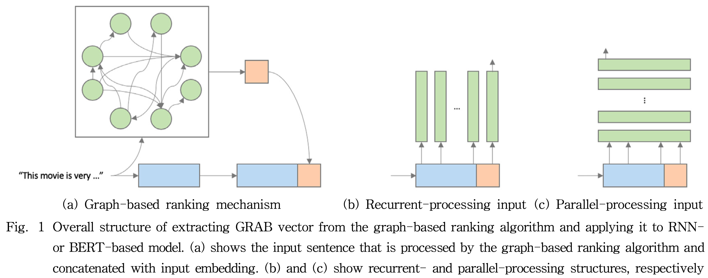
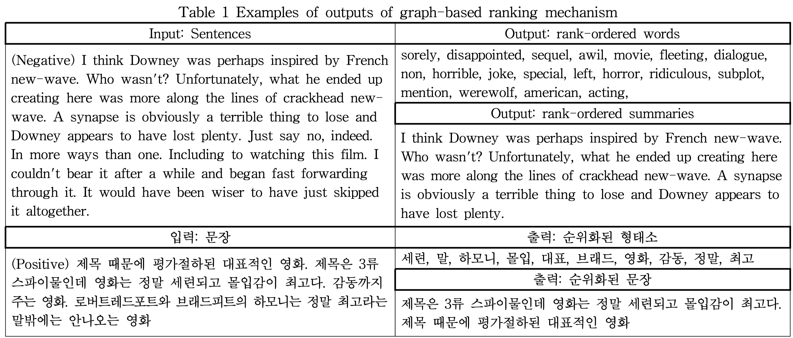
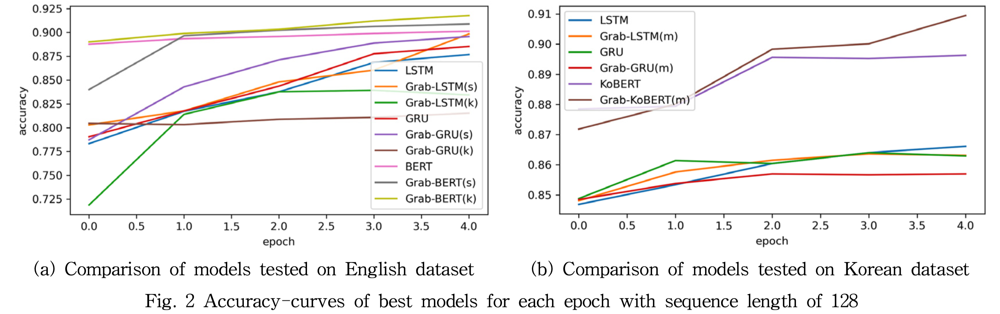
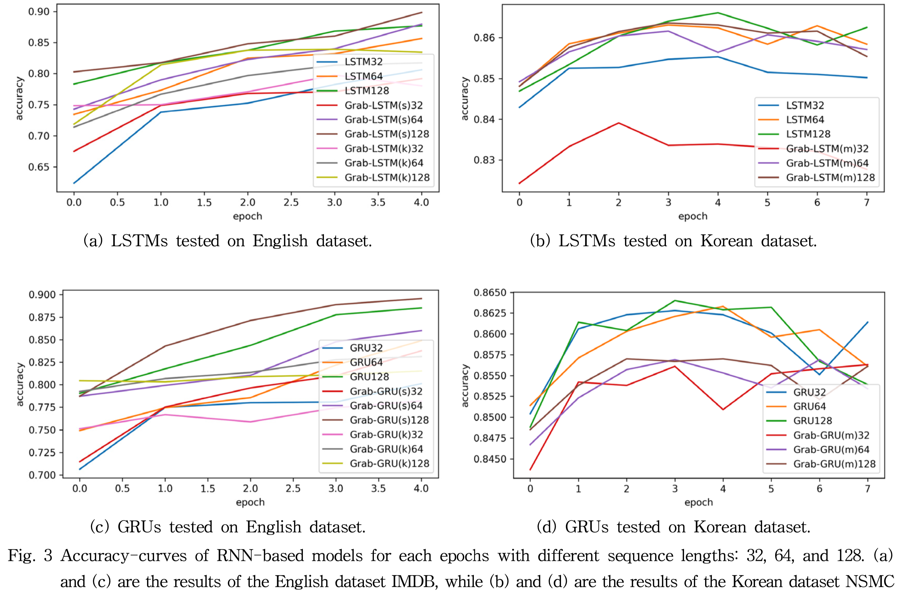
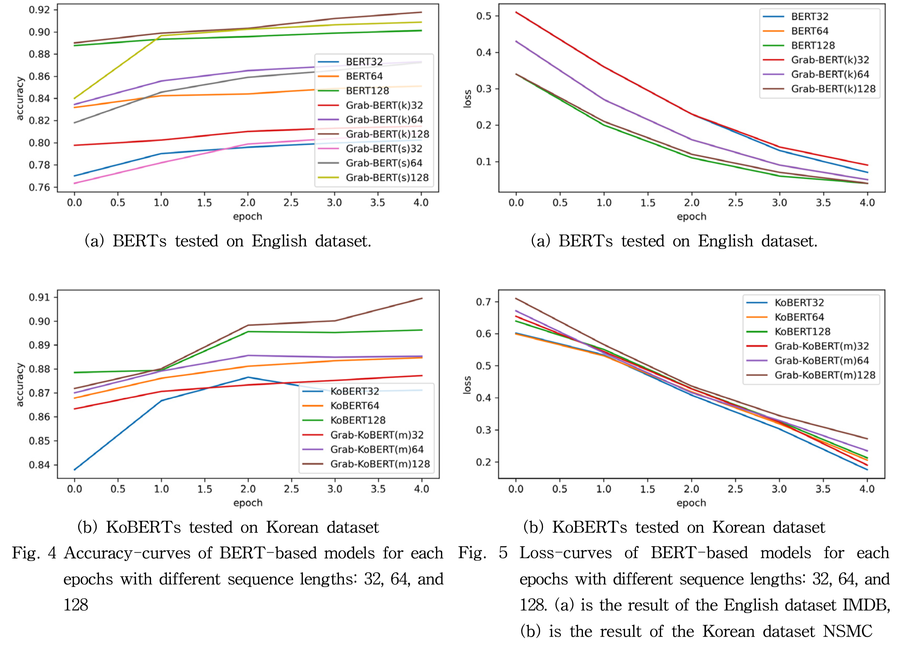

# GRAB vector, GRAB-(Ko)BERT

This is a implementation of the paper
(kor)\<그래프 순위 결정 메커니즘을 이용한 BERT 기반 감정분석 모델의 개선\>
(eng)[\<Improving BERT-based Sentiment Analysis Model using Graph-based Ranking Mechanism\>](https://www.dbpia.co.kr/pdf/pdfView.do?nodeId=NODE10528632&mark=0&useDate=&bookmarkCnt=1&ipRange=N&accessgl=Y&language=ko_KR)
(KIISE TCP 2021)

This paper is a future work from
(kor)\<감정 분석을 위한 그래프 순위화 기바 강인한 한국어 BERT 모델\>
(eng)[\<Robust Korean BERT Model for Sentiment Analysis using Graph-based Ranking Mechansim\>](https://www.dbpia.co.kr/pdf/pdfView.do?nodeId=NODE09874584&mark=0&useDate=&bookmarkCnt=1&ipRange=N&accessgl=Y&language=ko)
(best paper awarded from KCC2020)


## Abstract

> > Due to the need for automated document processing, artificial intelligence research has been actively
> > conducted in the field of natural lanugage processing(NLP). In this paper, we propose the GRAB vector
> > (GRAph-Based vector), which consists of vectorized keyword-based morphemes or summaries extracted
> > from the graph-based ranking mechanism. Next, we applied the GRAB vector to the sentiment analysis task,
> > which is an NLP task, and we proposed a more accurate and robust model, GRAB-BERT(GRAB vector-BERT model).
> > Then, to analyze the effect of the GRAB vector on this model, we compared the performances of recurrent
> > neural network models(RNNs) and BERT models with or without the application of the GRAB vecotr on both
> > English and Korean text samples with different sequence sizes. Our results demonstrate that applying the
> > GRAB vector to models such as BERT to process inputs in parallel improes the robustness of the model and
> > its performance. Furthermore, unlike BERT-based models, RNN models are more effective ehen applying
> > graph-based extracted summaries than when applying morpheme-based summaries.

### Requirements

* Python 3.6
* PyTorch 1.7.1
* Tensorflow 1.5.1

To install all the required elements, run the code:
```
bash requirements.txt
```

### Run scripts

The English textrank module (graph-based keywork extractor) is from [textrank](https://github.com/summanlp/textrank). 
The Korean textrank module (graph-based morpheme extractor) is from [textrank](https://github.com/lovit/textrank).
(Korean module requires jdk installation)

Implemented dataset list : [NSMC](https://github.com/e9t/nsmc), [IMDB](https://www.imdb.com/interfaces/).

To run the experiments, run the scripts:
```
sh run.sh
```

## Graph-based Ranking Mechanism and Appling to Parallel or Recurrent models

Graph-based Ranking mechanism is invented by [Rada Mihalcea et al](https://www.aclweb.org/anthology/W04-3252/) which is inspired by [Brin & Page](ilpubs.stanford.edu:8090/422/1/1999-66.pdf).
We applied the additional extracted features to different types of neural network-based models.

<p align="center">

</p>

experiments:
examples of outputs of graph-based ranking mechanism.

## Experimental Results

### Extracted formats of sentences by graph-based ranking mechanism

<p align="center">

</p>

### Performance

Accuracy for each model trained with a dequence length of 128 for the English dataset of IMDB and the Korean dataset of NSMC.


#### IMDB (English dataset)

| Model name             | Accuracy    | 
| ---------------------- | ----------- |
| LSTM                   | 0.8768      |
| GRAB-LTSM(__summary__) | __0.8984__  |
| GRAB-LSTM(keyword)     | 0.8344      |
| GRU                    | 0.8852      |
| GRAB-GRU(__summary__)  | __0.8956__  |
| GRAB-GRU(keyword)      | 0.8152      |
| BERT                   | 0.9012      |
| GRAB-BERT(summary)     | 0.9088      |
| GRAB-BERT(__keyword__) | __0.9177__  |


#### NSMC (Korean dataset)

| Model name                | Accuracy    | 
| ------------------------- | ----------- |
| LSTM                      | 0.8661      |
| GRAB-LTSM(morpheme)       | 0.8631      |
| GRU                       | 0.8626      |
| GRAB-GRU(morpheme)        | 0.8570      |
| KoBERT                    | 0.8963      |
| GRAB-KoBERT(__morpheme__) | __0.9095__  |

<p align="center">

</p>

<p align="center">

</p>

<p align="center">

</p>
