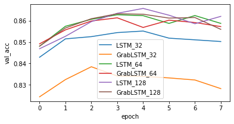
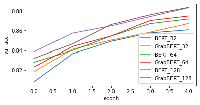
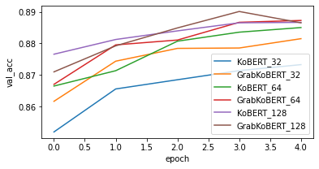
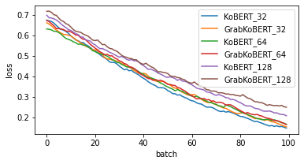

# GRAB-KoBERT

data : nsmc, kosac

nsmc data link :
https://github.com/e9t/nsmc

kosac data link : 
http://ling.snu.ac.kr/kosac/data/KOSAC_sample.zip

stanford sentiment analysis : 
https://ai.stanford.edu/~amaas/data/sentiment/aclImdb_v1.tar.gz

validation accuracy plot of lstm based models

validation accuracy plot of bert based models

validation accuracy plot of kobert based models

training loss plot of kobert based models

